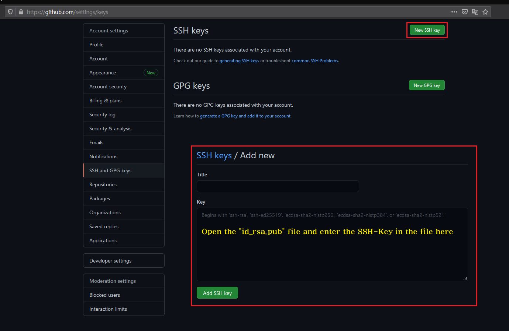
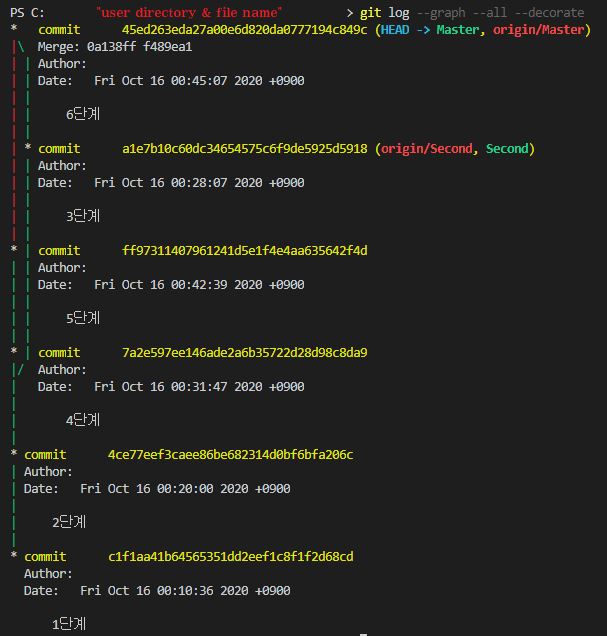

# How to useing Github
&nbsp;
### Development environment
---
* window os
  

&nbsp;
### Procedure
---
* Create SSH-Keygen [(link)](#-create-ssh-keygen)
* SSH-Key Github Registration [(link)](#-ssh-key-github-registration)
* SSH-Key Test [(link)](#-ssh-key-test)
* Host Registration [(link)](#-host-registration)
* Create Local Repository [(link)](#-create-local-repository)
* Git Add [(link)](#-git-add)
* Git Commit [(link)](#git-commit)
* git Log [(link)](#-git-log)

&nbsp;
### Create SSH-Keygen
---
    터미널을 열고 다음과 같이 입력한다.
```c
Microsoft Windows [Version 10.0.19041.867]
(c) 2020 Microsoft Corporation. All rights reserved.

$C:\Users\Users> //ssh-keygen -t rsa -C "Your E-mail"
Generating public/private rsa key pair.
Enter file in which to save the key (C:\Users\Users/.ssh/id_rsa):
C:\Users\Users/.ssh/id_rsa already exists.
Overwrite (y/n)? y //기존 SSH-key OverWirte
Enter passphrase (empty for no passphrase): //password (minimum five haracters) 
Enter same passphrase again: //password
Your identification has been saved in C:\Users\Users/.ssh/id_rsa.
Your public key has been saved in C:\Users\Users/.ssh/id_rsa.pub.
The key fingerprint is: //SHA256:************** "E-mail" 

The key's randomart image is:
+---[RSA 2048]----+
|**********       |
|**********       |
|********** *     |
|********** * *   |
|  **********     |
| *******         |
|****             |
|  ***            |
|   **            |
+----[SHA256]-----+

```
&nbsp;
### SSH-Key Github Registration
---
* Log in to GitHub.com. 
* Your Account settings.
https://github.com/settings/keys

</img>

&nbsp;
### SSH-Key Test
---
    터미널을 열고 다음과 같이 입력한다.

```c
C:\Users\Users>//SSH -T git@github.com
Enter passphrase for key 'C:\Users\Users/.ssh/id_rsa': // Key Password
Hi User! You've successfully authenticated, but GitHub does not provide shell access.
```

&nbsp;
### Host Registration
---
    .ssh/config을 열고 다음과 같이 입력한다.

```c
Host 'Host' 'ID'.github.com
HostName 'ID'.github.com 
User 'User E-mail'              
PreferredAuthentications publickey   
IdentityFile ~/.ssh/james_rsa   
```

&nbsp;
### Create Local Repository 
---
    git respository 생성할 파일명을 만들고 git init을 통해 "local repository"을 지정한다. 
```c
$pwd /git
$mkdir my-git //make git respository file
$cd my-git 
$ git init // Specify git file location 
Initialized empty Git repository in ~/mygit/.git/ 
$ls –al 
total 0 
drwxr-xr-x  7 'git_id' staff 238 3 29 03:47 . 
drwxr-xr-x 27 'git_id' staff 918 3 29 03:47 ..
drwxr-xr-x 11 'git_id' staff 374 3 29 03:47 .git
```

&nbsp;
### Git Add
---
     commit을 하기위한 전 단계로 respository에 저장하기 위한 파일을 추가한다.
```c
$ git add hellogit.txt 
$ 
$ git status
    or
$ git add . // dot(.) add all file
```

&nbsp;
### Git Commit
***
    "gif add"를 통해 추가된 파일을 "git commit"을 통해 respository에 등록합니다. 이후 파일의 변경사항이 기록되며, commit의 단위인 "branch"가 생성됩니다.

```c
$ git commit -m "messages"
[master (root-commit) a4235b7] init mygit 1 file changed, 3 insertions(+)
create mode 100644 hellogit.txt

$ vi hellogit.txt //edit txt

$ git status 
# On branch master 
# Changes not staged for commit: 
# (use "git add <file>..." to update what will be committed)
# (use "git checkout -- <file>..." to discard changes in working directory) 
#
# modified: hellogit.txt
#
no changes added to commit (use "git add" and/or "git commit -a") 
$ git commit -­m "messages"

```
### Git Log
---
    git log를 통해 commit log를 볼 수 있습니다.
    또한 사용자가 보기 편하게 그래프 형식으로도 출력 가능합니다.

```c
$ git log 
commit c97cf92e927d382c11380be426c0b6be5ef9b13d //40 byte hashcode 
Author: "git_id" <"user E-mail"> 
Date: Sun Mar 31 16:52:01 2013 +0900 

    "Modify message in english" // 기록한 메세지가 표시됨. 

Sun Mar 31 16:44:07 2013 +0900
commit a4235b756cb6e41e75d98b0bf8454e7265e61af2 //40 byte hashcode 
Author: "git_id" <"user E-mail"> 
Date: Sun Mar 31 16:44:07 2013 +0900

    init mygit

```


    
```C
// print log gragp
$ git log --graph --all --decorate 
```
</img>

---
